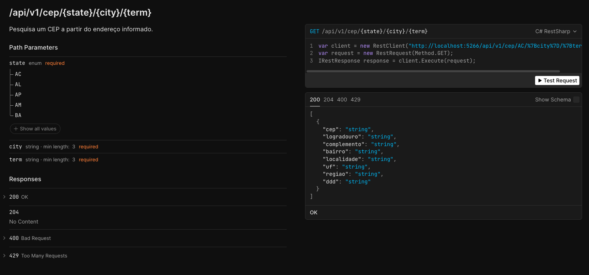
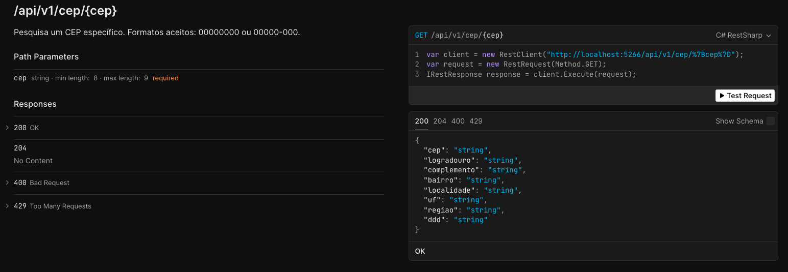

[](https://codecov.io/github/leandrobattochio/SoftCep)


# SoftCep API

API REST intermediária (camada anti-corrupção) para consultas de CEP utilizando o provedor público ViaCep, oferecendo
resiliência, padronização de contrato, caching, limitação de requisições.

## Sumário

- [Contexto do Problema](#contexto-do-problema)
- [Objetivos do MVP](#objetivos-do-mvp)
- [Escopo Entregue](#escopo-entregue)
- [Arquitetura & Camadas](#arquitetura--camadas)
- [Principais Decisões Técnicas](#principais-decisões-técnicas)
- [Fluxo de Requisição](#fluxo-de-requisição)
- [Endpoints](#endpoints)
- [Versionamento](#versionamento)
- [Contratos de Resposta](#contratos-de-resposta)
- [Resiliência & Confiabilidade](#resiliência--confiabilidade)
- [Caching](#caching)
- [Rate Limiting](#rate-limiting)
- [Validações](#validações)
- [Observabilidade & Logging](#observabilidade--logging)
- [Testes](#testes)
- [Observabilidade](#observabilidade)
- [Scalar](#scalar)
- [Como Executar](#como-executar)
- [Configurações](#configurações)

## Contexto do Problema

O sistema cliente (ex: SoftFront) consome diretamente a API pública ViaCep. O provedor tem apresentado instabilidade,
degradando a experiência dos usuários e aumentando a complexidade de tratamento de falhas nos consumidores.

## Objetivos do MVP

1. Uniformizar contrato para consulta de CEP.
2. Adicionar resiliência (retry com backoff exponencial).
3. Reduzir carga e dependência direta do ViaCep via caching.
4. Proteger contra abuso (rate limiting por IP).
5. Facilitar observabilidade e extensões futuras.

## Escopo Entregue

- .NET 9 e C# 13.
- Endpoints: consulta por CEP e por endereço.
- Healthcheck no endpoint `/healthz`.
- Integração com ViaCep usando Refit.
- Retry com Polly (exponencial) até 5 tentativas.
- Cache em memória (HybridCache) + Redis.
- Rate Limiting por IP nas duas rotas (20 req/seg).
- Validação de CEP (8 ou 9 dígitos obrigatórios). Formatos aceitos: `00000000` ou `00000-000`.
- Documentação OpenAPI + UI (Scalar).
- Testes unitários e de integração (incluindo rate limiting e testcontainers).
- Logging estruturado com Serilog. Nível mínimo `Debug` em development e `Information` em produção.

## Arquitetura & Camadas

```text
SoftCep.Api
 ├─ Controllers        -> Exposição HTTP
 ├─ Application        -> Handlers (casos de uso)
 ├─ Domain             -> Modelos de domínio / mapeamentos (Mapperly)
 ├─ Infrastructure     -> Clientes externos (ViaCep) e DTOs externos
 ├─ Core               -> Cross-cutting (Consts, validações, logging, rate limiting)
 └─ Program.cs         -> Composition Root (DI + pipeline)
```

Aplicação monolítica, orientada a camadas com CQRS básico (apenas queries).

## Principais Decisões Técnicas

- Plataforma: .NET 9;
- HTTP Client: Refit (declaração concisa dos endpoints externos, reduz boilerplate).
- Resiliência: Polly (WaitAndRetry exponencial para falhas transitórias).
- Mapeamento: Mapperly (geração compile-time, performance e menos reflection).
- Caching: HybridCache (API moderna preparada para Redis / distribuído).
- Rate Limiting: Fixed Window por IP (simplicidade no MVP, fácil troca para Sliding Window).
- Observabilidade: Serilog (estrutura, enriquecimento, base para OpenTelemetry).
- Documentação: OpenAPI + Scalar UI, por ser uma interface mais avançada e amigável para desenvolvedores.
- Testes: xUnit + Shouldly + WebApplicationFactory (confiança em handlers e pipeline HTTP).

## Fluxo de Requisição

1. Cliente chama `/api/v1/cep/{cep}`.
2. Middleware Rate Limiting avalia IP.
3. Validação de CEP (atributo).
4. Handler tenta obter do cache (duas camadas).
5. Cache miss -> ViaCep (Refit + HttpClient + Polly Retry).
6. Mapeamento DTO externo -> modelo domínio.
7. Headers de cache-control adicionados.
8. Retorno 200 ou 204.
   Fluxo por endereço similar retornando lista.

## Endpoints

### GET /api/v1/cep/{cep}

Consulta um CEP específico.

Respostas:

- 200 (CepResult)
- 204 (não encontrado)
- 400 (CEP inválido)
- 429 (rate limit)
- 5xx (falhas)

### GET /api/v1/cep/{uf}/{cidade}/{termo}

Busca lista de CEPs por UF + cidade + termo parcial.

Respostas:

- 200 (lista)
- 204 (vazio)
- 429 (rate limit)
- 5xx (falhas)

OpenAPI em Development:

- `/openapi/v1.json`
- `/openapi/v2.json`
- `/scalar`

## Versionamento

Versão padrão: `v1`.

O MVP possui apenas `v1`, mas a estrutura suporta futuras versões via URL segmentada.
Como exemplo, foi adicionado para demonstração uma rota v2 que retorna um texto simples.

## Contratos de Resposta

O modelo `CepResult` é construído a partir da resposta do ViaCep, dessa forma ficamos independentes do retorno do
ViaCep.

```json
{
  "cep": "01001-000",
  "logradouro": "Praça da Sé",
  "complemento": "lado ímpar",
  "bairro": "Sé",
  "localidade": "São Paulo",
  "uf": "SP",
  "regiao": "Sudeste",
  "ddd": "11"
}
```

Lista: array deste modelo.

## Resiliência & Confiabilidade

- Retry exponencial (2^n) até 5 tentativas (`Consts.HttpRetryCount`).
- Timeout HTTP de 10s.

## Caching

- Duração: 24h (`Consts.CepCacheTime`).
- Chaves: `cache/cep/{cep}` e `cache/cep/address/{uf}/{cidade}/{termo}`.
- Duas camadas através do HybridCache (MemoryCache + Redis).

## Rate Limiting

- Política `PerIp20Rps` (20 requisição por segundo por IP) via Fixed Window.
- Teste de integração cobre funcionamento do Rate Limiting.

## Validações

- Atributo `CepValidationAttribute` para validação do formato do CEP.

## Observabilidade & Logging

- Serilog Console sink.
- Enriquecimento com `ApplicationName`.
- Logs para cache miss e startup.

## Testes

- Unitários (`SoftCep.Tests`): handlers, mapeamento, validações.
- Integração (`SoftCep.Integration.Tests`): endpoints, rate limiting. Usando TestContainers para simular container do
  Redis para mimetizar fielmente o ambiente de produção.
- Cobertura: coverlet (`dotnet test /p:CollectCoverage=true`).

## Observabilidade

Adicionado `Elasticsearch`, `Kibana` e `Heartbeat` para monitoramento da saúde da aplicação. Através do
`AddAllElasticApm` é
construído toda a observabilidade do APM da aplicação. Da mesma forma, através do Serilog os logs são enviados para o
Elasticsearch. Através do `Heartbeat`, monitoramos a saúde da nossa API. Tudo facilmente visualizado através da
interface
do Kibana.

## Scalar

Todos os endpoints estão completamente documentados na UI do Scalar, com status de resposta, payload de entrada e saída,
bem como o enum `state` pode ser facilmente visualizado quais são as opções válidas. Também é possível alterar entre
versões da API.




## Como Executar

Pré-requisito: .NET 9 SDK.

```bash
dotnet restore
dotnet build -c Release
dotnet test --no-build
```

Executar API:

```bash
cd src/SoftCep.Api
dotnet run
```

Documentação:

- http://localhost:5266/scalar (Somente em development)
- http://localhost:5266/openapi/v1.json
- http://localhost:5266/openapi/v2.json

Exemplo:

```bash
curl http://localhost:5266/api/v1/cep/01001000
```

## Configurações

`appsettings.json` esperado com a URL do ViaCep e conexão Redis:

```json
{
  "ConnectionStrings": {
    "Redis": "localhost:6379"
  },
  "Infrastructure": {
    "ViaCep": {
      "BaseUrl": "https://viacep.com.br/ws"
    }
  }
}
```